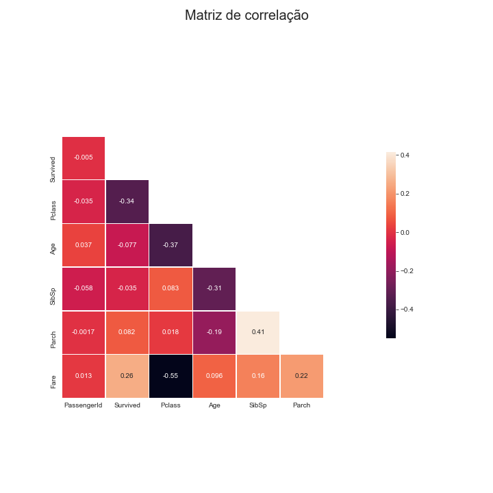
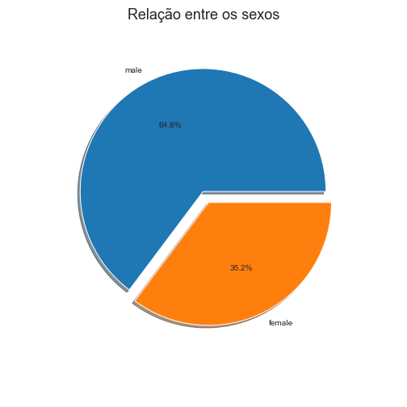
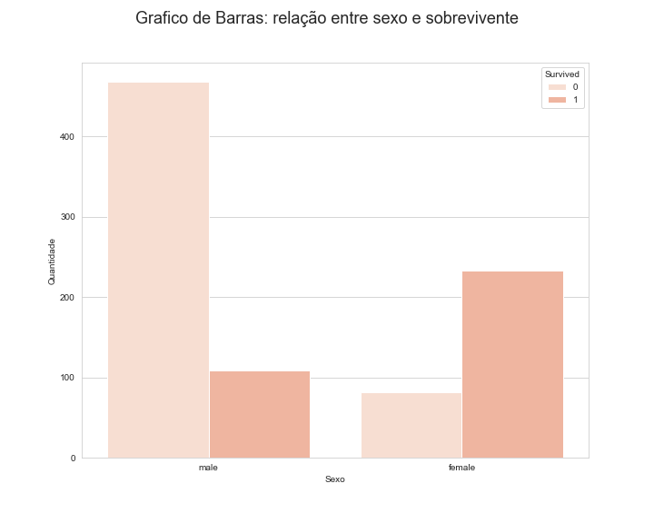
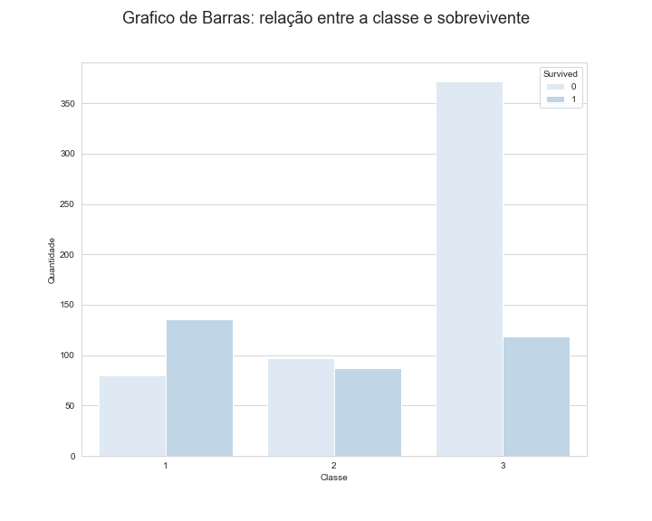
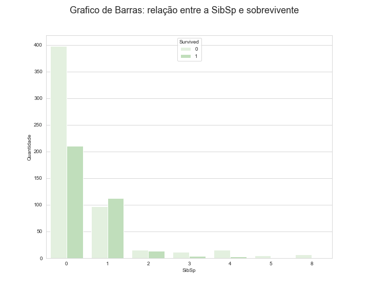
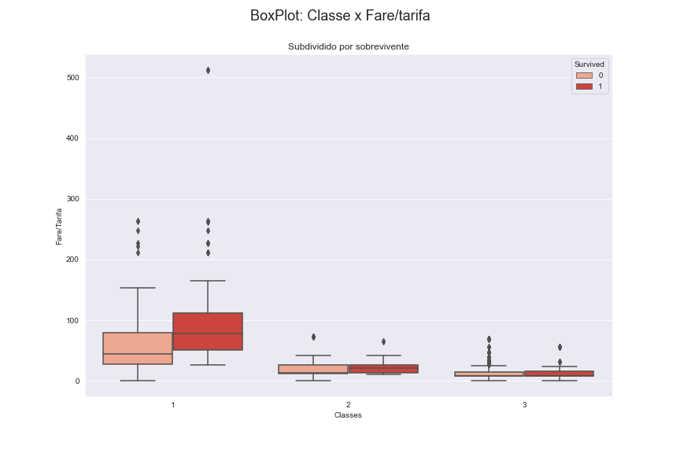

# 
 Titanic Competition </ceenter>

### Português

Esse Repositorio/Notbook tem como objtivo de mostrar como foi feita a Analise Explorátoria dos Dados (EDA) e em seguida como foi feito toda a parte de Pre-Processamento de dados até chegar na criação de diferentes tipo de modelos de Machine Learning (ML).

### English

This Repository / Notbook aims to show how the Exploratory Data Analysis (EDA) was done and then how the entire Pre-Processing of data was done until until you get to the part of creation of different types of Machine Learning (ML) models.

### Libraries/Bibliotcas:
  * Pandas
  * NumPy
  * Seaborn
  * Matplotlib
  * SkLearn

## Analíse Explorátoria dos Dados:

## Pré-Processamento:
  * Lidando com dados faltantes
  * One HotEncoding
  * Normmalização dos dados
  
## Modelos/Models Criados:

Além de criar diferentes tipos de modelos, foi-se feito um Tuning utilizando Grid Search para melhorar os diferentes tipos de Hyperparâmetros para cada tipo de modelo de aprendizado de maquina.

  * Support Vector Machine (SMV) - Acurácia de 80%
  * Decision Tree - Acurácia de 78%
  * Logistic Regression - Acurácia de 67%
  * Random Forest - Acurácia de 80%
